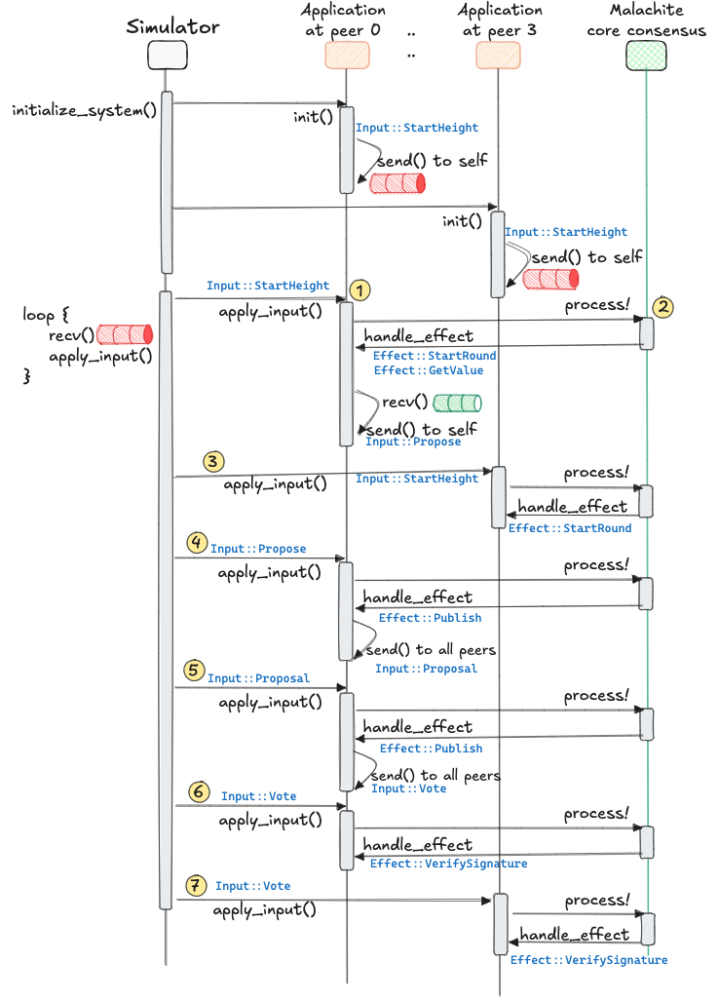

# Malachite Core Simulator

A simulator for the [Malachite][malachite] core libraries.

## Rationale

This application demonstrates the simplest way to instantiate the Malachite core library.
It also demonstrates the extreme flexibility of the library.

The simulator is meant to be a playground for learning how to code with the core library.

The simulator is meant to facilitate the experimentation with new abstractions _on top_ of the core library.
This is achieved by enabling quick prototyping and ways to fail fast in the writing of new applications,
because the simulator ignores orthogonal concerns such as networking,
signature verification, or transaction memory pool. 

## Overview

The simulator consists of three main parts:

1. The `main.rs` program,
2. The [`Simulator`][Simulator], and
3. Multiple instances of an [`Application`][app], each instance representing the program running at a peer.

The sketch below shows a system context diagram of these three parts. 

The Simulator orchestrates the execution of applications that are running at different peers,
where all applications are aiming to decide on values.
Each application represents a specific peer and is a simple data structure running in the same thread as all the
other peers.
The application is a wrapper over the Malachite core library,
which implements the core consensus state machine of the Tendermint algorithm
and does the actual heavy lifting behind the curtains.

### Assumptions

The system simulates the execution of a complex distributed system in a single, centralized process.
This is achieved through an array of assumptions, as follows:

- the applications at all peers execute in the same thread, and they execute sequentially (i.e., not in parallel with one another) 
- the simulator orchestrates the execution steps at various application instances, therefore, the simulator is trusted;
- there is no need for actual networking code: applications send messages to one another via a [`Sender`][Sender] on a local channel;
- digital signatures: all peers have the same public/private key; they sign each message, but verification is mocked; 
- transaction memory pool:
  - peers do not decide on (i.e., finalize) blocks of transactions, but on a single value of type [`BaseValue`][BaseValue];
  - there is no actual memory pool that peers gossip to one another, instead there is one single source of `BaseValue` that the `main.rs` program creates and sends over a [crossbeam channel][crossbeam] to all peers
- transaction execution:
  - the application at each peer does not execute the values that are decided; instead, each peer simply sends each decision via a [`Sender`][Sender] to the `main.rs` program
- parallelism—there are three threads:
  1. a thread in `main.rs` for producing a stream of [`BaseValue`][BaseValue] which peers propose;
  2. a thread in `main.rs` that consumes the decided [`BaseValue`][BaseValue];
  3. a thread in which the simulator (together with all the peers) executes in.

## Design

Knowledge of the Tendermint algorithm is not strictly necessary, 
but will help in the understanding of many details that follow.
See this [overview][tendermint] for a good refresher.

### Basic Pattern

The central part of the simulator consists of an elementary busy loop.
Recall that there is no actual networking code,
so whenever we refer to a "network" component, this refers to a local channel.

The loop has two steps:

1. Select the next message from the network; each message has a certain destination.
2. Give control to the destination application and let it execute that message; the application will create further message(s) that it sends to the network.

Each message contains a special instruction, specifically it is an [`Input`][input].
Every input instructs the application to take a certain step towards reaching agreement and deciding on a value,
so that the other applications decide on the same value.

Prior to the busy loop above,
the simulator initializes each application with a specific input called [`Input::StarHeight`][sh].  

The diagram below depicts the busy loop.

### Sequence

The sequence diagram below depicts the beginning of an execution.

Some remarks on this sequence diagram follow.

#### Initializing the system

During this method, the simulator simply iterates over all the existing peers and triggers
a method called `init` on each.
In the diagram there are only two peers, namely `0` and `3` for the sake of simplicity, but in a real system
there would be minimum four peers.
While executing the `init` method, each peer creates an input called `Input::StartHeight` and they send it to
themselves.
This input will be consumed later.

#### Busy loop

> [!NOTE]
> The steps on yellow background from the sequence diagram correspond with the steps in the enumerated list here.

The simulator calls `recv` on the channel that represents the network,
and applies the busy loop we described above, specifically:

1. the first message is called `Input::StartHeight` and has as destination peer 0; the simulator therefore selects this peer and calls `apply_input` on the application logic corresponding to this peer with the given input.
2. peer 0 calls `process!` on the core malachite library, and then handles the effect which this call produced
   1. specifically, the first effect is `Effect::StartRound`, which is does not lead to any specific action
   2. peer 0, however, also encounters another effect, called `Effect::GetValue`
   3. to handle this effect, peer 0 will need to provide another input to the library, specifically `Input::Propose`
   4. this input is enqueued in the network for later use; the destination is "self," i.e., peer 0
3. the simulator then selects the next message, which is also `Input::StartHeight`, this time with destination peer 3
   1. the same happens as with peer 0, except that peer 3 does not encounter any `Effect::GetValue`
   2. this is because only one peer per round is a proposer; in this case, peer 0 was selected as proposer
4. the simulator now handles the input which peer 0 produced at step 2.iv -- `Input::Propose`
   1. the simulator applies this input at peer 0
   2. the side effect of this input is that peer 0 is now expected to perform a `Effect::Publish`, which means that this peer is supposed to broadcast a message to the other peers
   3. in this case, the message has type `Input::Proposal`
   4. peer 0 sends the proposal message, selecting all the other peers in the network as destinations
5. peer 0 applies `Input::Proposal`
   1. the side effect is another `Effect::Publish`
   2. this time, the message to be published is a vote, and this takes the form of `Input::Vote`
   3. specifically, the vote is called a Prevote
6. peer 0 applies `Input::Vote`
   1. the side effect is  `Effect::VerifySignature`
   2. the malachite core library uses this effect to instruct the application at peer 0 to verify the signature of the vote that just arrived
   3. since we ignore signature verification, this operation is a no-op
7. peer 3 applies `Input::Vote`
   1. similarly to peer 0, the side effect at peer 3 is  `Effect::VerifySignature`

## Requirements

- [malachite][malachite] v0.0.1

[//]: # (references)

[malachite]: https://github.com/informalsystems/malachite
[Simulator]: ./src/simulator.rs
[Sender]: https://doc.rust-lang.org/std/sync/mpsc/struct.Sender.html
[BaseValue]: ./src/context/value.rs
[crossbeam]: https://docs.rs/crossbeam-channel/latest/crossbeam_channel/
[app]: ./src/application.rs
[input]: https://github.com/informalsystems/malachite/blob/main/ARCHITECTURE.md#inputs-and-effects
[sh]: https://github.com/informalsystems/malachite/blob/6f4cfce72fa0362d743320c0e3ea8fa46b4283b0/code/crates/core-consensus/src/input.rs#L18
[tendermint]: https://github.com/informalsystems/malachite/blob/v0.0.1/specs/consensus/overview.md